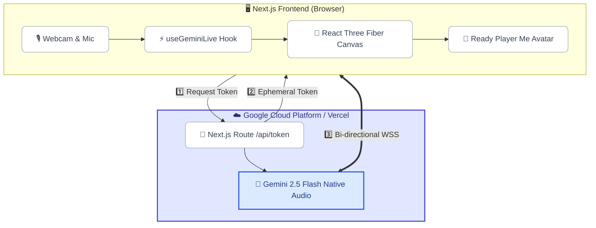
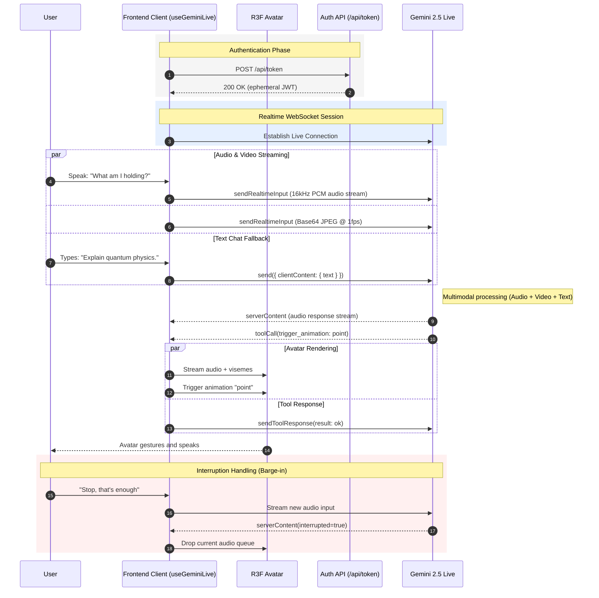

<div align="center">
  <h1>Digital Persona 🤖🎭</h1>
  <p><strong>A Persistent, Emotionally Reactive 3D Avatar Powered by Gemini 2.5 Flash Native Audio.</strong></p>
</div>

> **Bird's Eye View:** A fully embodied 3D digital instance built for the Google Gemini Live Agent Challenge. It merges the Gemini Live Multimodal API with a React Three Fiber driven Ready Player Me avatar, achieving sub-100ms conversational latency with procedural "life-like" ARKit blendshape expressions.

> [!WARNING]
> **Active Development Warning:** This project was rapidly architected for the Gemini Live Agent Challenge and is under heavy, active development. Some configurations may break, and unstable branches might exhibit experimental behaviors. See the issues log before deploying to production.

---

## 📖 Overview

Digital Persona is a state-of-the-art multimodal AI implementation. It does not simply return text; it is an **embodied entity** capable of sustaining natural face-to-face interactions. Utilizing a Next.js 16 Client-to-Server WebSockets architecture, the avatar leverages **Google's Gemini Multimodal Live API** to hear, see, and express emotions natively. 

The application utilizes native audio, Voice Activity Detection (Barge-in), Session Management, and Ephemeral Tokens for secure, low-latency browser streaming.

### 💖 The Engineering Effort
We poured hundreds of hours into solving complex constraints. Traditional chatbots just ping APIs, but we faced the visceral challenge of translating an LLM's text and audio output into physical 3D behaviors in under 100 milliseconds. We engineered custom real-time audio chunkers, mathematical sine-wave breathers for the 3D model, co-articulating Lip-Sync extractors, and built an entirely custom "Nervous System" that links Gemini Tool calling directly into Three.js WebGL animations. Every pixel, floating panel, and blink speed curve was obsessively tuned for maximum realism.

---

## 🌟 The Vision

Text assistants are a thing of the past. The future of AI interaction requires a *Substrate* (the 3D Model), a *Brain* (Gemini 2.5 Flash), and a *Body* (R3F Scene) acting in unison. Digital Persona pushes the envelope by prioritizing **Emotive Realism**. The system doesn't just play canned animations; it incorporates procedural life behaviors—natural blinking, breathing, saccades (micro eye-movements), and context-aware ARKit emotional blending—yielding an almost human-like interactive experience.

---

## 🚀 Key Features

### 1. **Zero-Latency Conversational Architecture**
- **Client-to-Server WebSockets:** Uses Ephemeral Tokens provisioned by a Next.js backend, dropping the proxy overhead. The frontend connects directly to Gemini for pure audio streaming.
- **Interruption Handling (VAD):** Employs Gemini's native Voice Activity Detection. If a user interrupts ("barge-in"), the avatar instantly discards audio buffers, cancels animations, and listens.

### 2. **Emotive Realism & Lip-Syncing**
- **Co-articulation:** Combines ARKit blendshapes and Oculus Visemes for smooth phoneme transitions, rather than robotic mouth snaps.
- **Procedural "Life":** Features involuntary micro-twitches, asymmetric eyelid speeds during blinking (~100ms close, ~150ms open), and a sine-wave driven respiratory rate (~6 breaths/min).
- **Affective Responses:** Gemini maps sentiment to ARKit expressions (e.g., pulling `browDownRight`, `mouthFrownLeft` for sadness) concurrently with audio delivery.

### 3. **Deep Multimodal Awareness**
- **Visual Analysis (Webcam Streaming):** The frontend continuously captures the user's physical environment via the webcam (pushing Base64 JPEG frames at 1 FPS). This allows the Gemini model to literally "see" you, deeply analyze your surroundings, and ground its answers based on visual context. It can even trigger physical avatar actions based on what you hold up to the camera!
- **Hybrid Text Chat Integration:** Don't want to speak? The system features a seamless text chat fallback. You can type messages directly into the UI, which are routed natively through the exact same real-time multimodal session, allowing for rich text-and-audio conversations.
- **Real-Time Function Calling (The Nervous System):** Exposes `trigger_animation`, `set_persona_mode`, `set_expression`, `display_text` to the model over the WebSocket, enabling physical gesticulations based on conversational intent.

### 4. **🎨 Extensive UI & Configurations Control Panel**
We designed a glassmorphism "Control Center" providing granular runtime configurations.
- **Floating Chatbox:** Interleave text input if you don't want to speak, complete with API debugging logs and a live transcript feed.
- **Persona Context Configurations:** Change the prompt dynamically (e.g., Tutor, Therapist, Interviewer) at runtime.
- **Avatar Toggles:** Dynamically select and preview the base standing/idle animations.
- **Gemini Feature Toggles:** Dynamically enable or disable:
  - `Google Search Grounding` (Allows the agent to pull live internet data)
  - `Proactive Audio` (Allows the agent to interrupt you)
- **Cinematic Camera System:** Seamless zoom framing toggles between Portrait and Full-Body views depending on the context of the conversation.

---

## 🏗️ High-Level Architecture

The system utilizes an Ephemeral Token proxy to establish a direct, low-latency WebSocket connection to the Gemini Multi-Modal Live API directly from the browser, bypassing heavy backend routing.



### 🔄 Real-Time Interaction Sequence (VAD & Tool Calling)

This sequence illustrates the sub-100ms latency loop natively handling interruptions (Voice Activity Detection).



---

## 🛠 Technology Stack

- **Framework:** Next.js 16, React 19
- **3D Rendering:** Three.js, React Three Fiber (`@react-three/fiber`), `@react-three/drei`
- **AI Core:** `@google/genai` (Unified SDK), Gemini 2.5 Flash Native Audio
- **Audio Processing:** 16-bit PCM, 16kHz Mono WebSockets Streaming
- **UI / Styling:** Tailwind CSS v4, Framer Motion, Radix UI
- **State Management:** Zustand (for transient high-FPS 3D render loops)

---

## ⚙️ Getting Started

### Prerequisites
- Node.js (v20+)
- Google Cloud Project with the **Gemini API** enabled (`GEMINI_API_KEY`)

### Installation

1. **Clone & Install Dependencies**
   ```bash
   git clone <repo-url>
   cd digital-persona
   npm install
   ```

2. **Configure Environment Variables**
   Create a `.env.local` file in the root directory:
   ```env
   GEMINI_API_KEY=your_gemini_api_key_here
   ```

3. **Validate the Substrate (Avatar Model)**
   Ensure the avatar and animations are correctly placed:
   ```bash
   npm run setup-avatar
   ```

4. **Run the Development Server**
   ```bash
   npm run dev
   ```
   Navigate to [http://localhost:3000](http://localhost:3000). *(Make sure to grant Microphone & Camera permissions!)*

---

## 📂 Project Structure Overview

- [`/public`](./public/README.md) - Contains the Avatar `.glb` file, animations (`.fbx` / `.glb`), and global assets. 
- [`/src`](./src/README.md) - Main application source code. Home to the `useGeminiLive` session manager, Three.js components, and React UI overlays.
- [`/project_docs`](./project_docs/README.md) - The master guide. Contains organized subdirectories for `/architecture`, `/gemini_api`, `/avatar_and_animation`, and `/ui_and_design`.
- `/scripts` - Node scripts for validating and fetching required 3D resources.

> [!NOTE] 
> Dive into the individual subdirectories for specialized `README.md` files explaining their granular internal operations.
