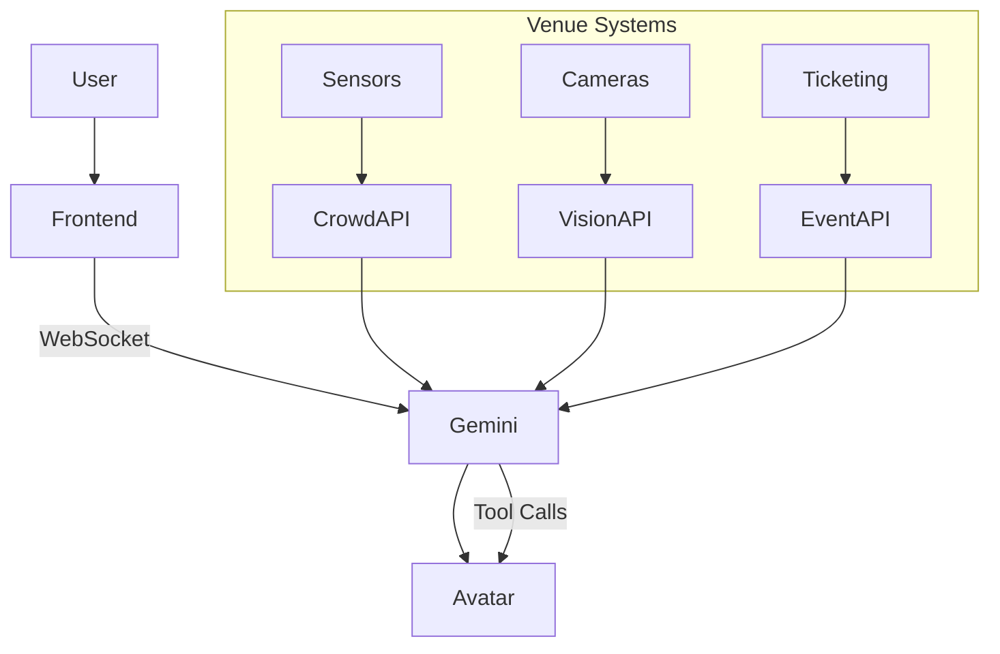

  <h1>Smart Venue Persona 🤖🏟️</h1>
  
<strong>An AI-Powered, Emotionally Intelligent 3D Assistant for Seamless Stadium Experiences</strong>

> **Problem Statement:** Design a solution that improves the physical event experience for attendees at large-scale sporting venues by addressing crowd movement, waiting times, and real-time coordination.

> **Solution:** Smart Venue Persona transforms stadium chaos into a guided, intelligent experience using a real-time multimodal AI avatar powered by Gemini 2.5 Flash.

---

## 📖 Overview

Smart Venue Persona is a **state-of-the-art multimodal AI system** that acts as a **personal concierge inside large-scale sporting venues**.

Instead of static apps or maps, users interact with a **fully embodied 3D avatar** that can:
- Hear 🎙️
- See 👁️
- Speak 🗣️
- Express emotions 😊

Built using:
- **Gemini 2.5 Flash (Multimodal Live API)**
- **React Three Fiber (3D Avatar Rendering)**
- **Next.js WebSocket Architecture**

---

## 🌍 The Vision

The future of event experiences is not apps — it's **intelligent companions**.

Smart Venue Persona combines:
- **Substrate:** 3D Avatar (Ready Player Me)
- **Brain:** Gemini AI
- **Body:** Real-time interactive scene (R3F)

The system delivers **human-like interaction + real-time intelligence** to guide users through crowded, dynamic environments.

---

## 🚀 Key Features

### 🧭 1. Real-Time Crowd Navigation
- Live crowd density analysis using camera feeds and sensors
- AI-generated smart routing to avoid congestion
- Example:
  - “Gate 3 is crowded, use Gate 5 instead”

---

### ⏳ 2. Predictive Queue Intelligence
- Estimates wait times for:
  - Food stalls 🍔
  - Washrooms 🚻
  - Entry/exit gates 🚪
- Suggests faster alternatives in real time

---

### 🎙️ 3. Voice-Based AI Assistant
- Natural conversation with the avatar
- Examples:
  - “Where is my seat?”
  - “Shortest queue for food?”
- Supports **barge-in interruption (VAD)**

---

### 👤 4. Embodied 3D Avatar Interaction
- Realistic facial expressions using ARKit blendshapes
- Lip-sync with co-articulation
- Natural behaviors:
  - Blinking
  - Breathing
  - Micro eye movements

---

### 🎥 5. Multimodal Awareness (Camera + Context)
- Scan ticket → get directions instantly
- Detect surroundings using webcam
- Context-aware responses

---

### 📡 6. Real-Time Event Coordination
- Live alerts:
  - Match starting soon
  - Crowd surge warnings
  - Emergency route guidance

---

### ⚡ 7. Zero-Latency Architecture
- Direct WebSocket connection to Gemini
- Sub-100ms response time
- Ephemeral token-based authentication

---

## 🏗️ High-Level Architecture

