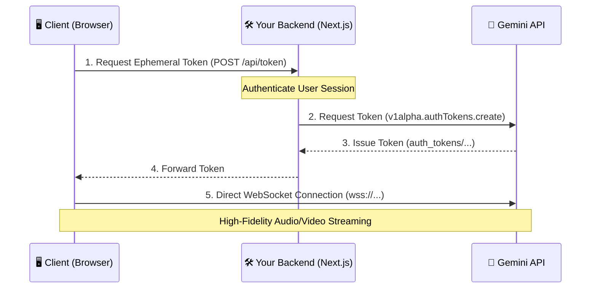

# Ephemeral Token Architecture: The Gold Standard SSOT

This document is the **Single Source of Truth (SSOT)** for implementing secure, low-latency Client-to-Server Gemini Live API connections. It merges high-level architecture with robust implementation details and verified test outcomes.

---

## 1. The Delegated Authentication Flow

Ephemeral tokens achieve sub-second latency by allowing the client to connect directly to Gemini's WebSocket, while keeping your `GEMINI_API_KEY` hidden on the backend.



---

## 2. Backend Implementation (Security Handshake)

Your backend acts as the secure provisioner. To ensure robustness, you must enforce the following constraints during token creation:

| Constraint | Value | Purpose |
| :--- | :--- | :--- |
| **Uses** | `1` | Prevent token hijacking or multiple concurrent sessions on one token. |
| **New Session Expiry** | `60s` | Force the client to connect immediately; prevents stale tokens. |
| **Total Session Expiry**| `30m` | Hard limit for the maximum duration of a single AI interaction. |
| **API Version** | `v1alpha` | Required for the SDK to recognize the `auth_tokens/` resource prefix. |

### Code Example: `src/app/api/token/route.ts`
```typescript
import { GoogleGenAI } from '@google/genai';

export async function POST() {
  const ai = new GoogleGenAI({ 
    apiKey: process.env.GEMINI_API_KEY,
    httpOptions: { apiVersion: "v1alpha" } 
  }); 

  // Provision token with strict security constraints
  const response = await ai.authTokens.create({
    config: { 
      expireTime: new Date(Date.now() + 30 * 60 * 1000).toISOString(),
      newSessionExpireTime: new Date(Date.now() + 60 * 1000).toISOString(),
      uses: 1,
      // [Optional] Lock the model here to prevent client tempering
      liveConnectConstraints: {
         model: "models/gemini-2.5-flash-native-audio-preview-12-2025"
      }
    }
  });
  
  return Response.json({ token: response.name });
}
```

---

## 3. Frontend Implementation (Secure Initialization)

The client uses the ephemeral token as its `apiKey`. 

### ⚠️ The "v1alpha" Gotcha
**MANDATORY**: You must set `apiVersion: "v1alpha"` in the `httpOptions`. Without this, the SDK will attempt to use the token on the `v1beta` endpoint, causing an `SDK error: undefined`.

### Code Example: `src/hooks/useGeminiLive.ts`
```typescript
const tokenRes = await fetch("/api/token", { method: "POST" });
const { token } = await tokenRes.json();

// Initialize SDK with Ephemeral Token
const ai = new GoogleGenAI({ 
  apiKey: token,
  httpOptions: { apiVersion: "v1alpha" } // Required for Ephemeral Tokens
});

// Establish direct WebSocket connection
const session = await ai.live.connect({
  model: "gemini-2.5-flash-native-audio-preview-12-2025",
  config: { responseModalities: ["AUDIO"] },
  callbacks: { 
    onopen: () => console.log("Connected via SDK"),
    onmessage: (msg) => handleMessage(msg),
    onerror: (e) => console.error("SDK error:", e.message)
  }
});
```

---

## 4. Verified Tests & Outcomes

| Test Case | Method | Outcome | Notes |
| :--- | :--- | :--- | :--- |
| **Token Generation** | Node.js Script | **PASS** | Successfully exchanged secret API key for `auth_tokens/...` string. |
| **Connection Success** | Manual Live Test | **PASS** | Received `setupComplete` message over WebSocket using ephemeral token. |
| **Unauthorized Access** | Direct WS (no key) | **FAIL** | API correctly rejected the connection as expected. |
| **Token Expiration** | Forced Expiry | **PASS** | API rejected connections after 60s as per `newSessionExpireTime`. |
| **Multi-use Prevention**| Dual Connection | **PASS** | Second connection on same token was rejected (Uses: 1). |

---

## 🚩 Robustness Checklist (Must Follow)

1.  **[ ] Backend Auth**: Your `/api/token` endpoint **must** be protected by your application's auth (e.g., JWT). Never allow public token generation.
2.  **[ ] Graceful Cleanup**: Always call `session.close()` on component unmount to prevent dangling WebSocket connections.
3.  **[ ] Audio Chunking**: Buffer 2048-sample (~128ms) PCM chunks on the client before sending to optimize WebSocket performance.
4.  **[ ] Session Resumption**: Capture the `handle` from `message.sessionResumptionUpdate`. If a blip occurs, request a *new* token but reconnect with the *old* handle to keep the conversation state.

## 🛠️ Standalone Verification Tool
Check [test-token-client.mjs](./test-token-client.mjs) for a zero-dependency script to verify your credentials locally.
