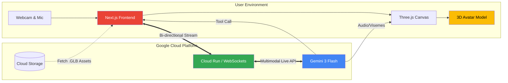
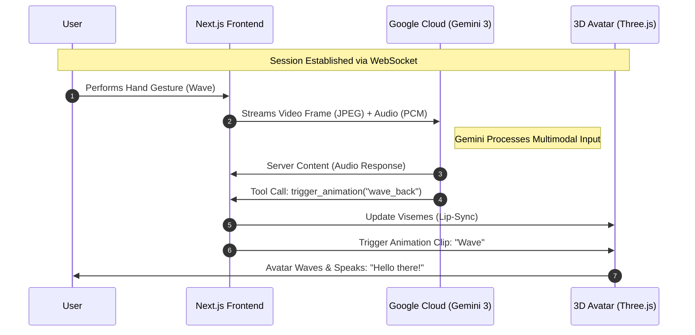

```mermaid
    graph LR
    subgraph Client ["User Environment"]
        A[Webcam & Mic] --> B[Next.js Frontend]
        B --> C[Three.js Canvas]
        C --> D[3D Avatar Model]
    end

    subgraph Backend ["Google Cloud Platform"]
        E[Cloud Run / WebSockets]
        F[Gemini 3 Flash]
        G[(Cloud Storage)]
    end

    %% Connection Logic
    B <==>|Bi-directional Stream| E
    E <==>|Multimodal Live API| F
    G -.->|Fetch .GLB Assets| B

    %% Intent Logic
    F -- Tool Call --> B
    F -- Audio/Visemes --> C

    %% Styling
    style F fill:#4285F4,color:#fff
    style E fill:#34A853,color:#fff
    style B fill:#EA4335,color:#fff
    style D fill:#FBBC05,color:#000
```

---

```mermaid
sequenceDiagram
    autonumber
    participant U as User
    participant F as Next.js Frontend
    participant G as Google Cloud (Gemini 3)
    participant A as 3D Avatar (Three.js)

    Note over U, A: Session Established via WebSocket
    U->>F: Performs Hand Gesture (Wave)
    F->>G: Streams Video Frame (JPEG) + Audio (PCM)
    
    Note right of G: Gemini Processes Multimodal Input
    
    G->>F: Server Content (Audio Response)
    G->>F: Tool Call: trigger_animation("wave_back")
    
    F->>A: Update Visemes (Lip-Sync)
    F->>A: Trigger Animation Clip: "Wave"
    
    A->>U: Avatar Waves & Speaks: "Hello there!"
```