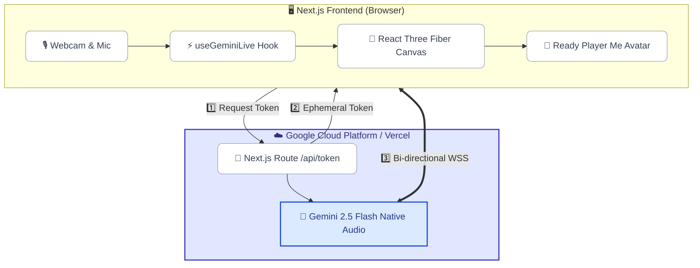
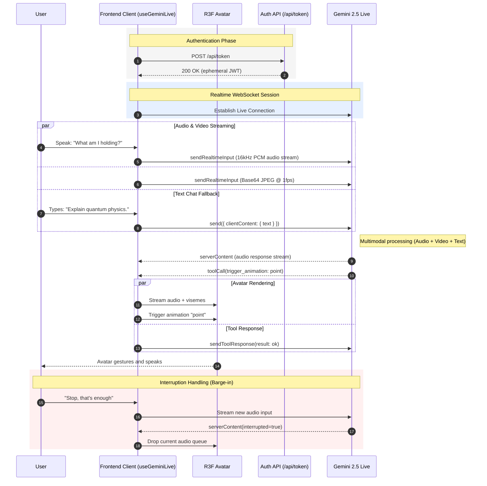

# System Architecture Diagrams

This document contains the visual topology of the Digital Persona, updated to reflect the `v1alpha` Gemini Multimodal Live API SDK and the Ephemeral Token proxy structure.

## 1. High-Level Resource Topology

---

## 2. Real-Time Interaction Sequence (VAD & Tool Calling)

This sequence illustrates the sub-100ms latency loop. Note how the client establishes a secure connection *without* exposing the root `GEMINI_API_KEY`, and how Native Audio handles interruptions (Voice Activity Detection).

