# Digital Persona Animation Architecture

This document details how the Digital Persona maps ambiguous, conversational output from the Gemini Live LLM into precise, high-fidelity 3D skeletal animations using a localized Semantic Fuzzy Matching pipeline.

## The Challenge
When a user tells an AI, "Do a crazy happy dance!", the LLM doesn't know our exact internal file names (e.g., `M_Dances_002.glb`). If we force the LLM to memorize 250+ exact file names, it wastes context tokens and frequently hallucinates invalid file paths, breaking the 3D Avatar.

## The Solution: Semantic Intent Resolution
Instead of fighting the LLM, we let the LLM output whatever abstract string it wants (e.g. `gesture_name: "happy_dance"`). We then intercept that string on the frontend and run it through a mathematical **Multi-Factor Semantic Matcher** to find the closest logical animation in our registry.

### End-to-End Pipeline

```mermaid
sequenceDiagram
    autonumber
    participant User as User Camera/Mic
    participant Gemini as Gemini Live API
    participant App as page.tsx (Tool Handler)
    participant Matcher as animationMatcher.ts
    participant Store as Zustand Store
    participant R3F as Avatar.tsx (3D Scene)

    User->>Gemini: "I'm so excited! Let's party!"
    Note over Gemini: LLM analyzes emotion & intent
    Gemini->>App: trigger_animation({ gesture_name: "excited party dance" })
    
    App->>Matcher: findBestAnimationMatch("excited party dance", registry)
    
    rect rgb(20, 30, 40)
        Note over Matcher: Local Semantic Engine
        Matcher->>Matcher: 1. Tokenize intent: ["excited", "party", "dance"]
        Matcher->>Matcher: 2. Filter via Salient Overlaps (instantly drop idles)
        Matcher->>Matcher: 3. Calculate Weighted Jaccard Similarity against PAD metrics
        Matcher->>Matcher: 4. Select highest scoring key
    end
    
    Matcher-->>App: Return: "masculine_dance_m_dances_002"
    App->>Store: setAnimation("masculine_dance_m_dances_002")
    
    Store-->>R3F: Reactive State Update
    Note over R3F: useDynamicAnimations() Hook
    R3F->>R3F: Lazy fetch & load .glb binary
    R3F->>R3F: Crossfade animation tracks
```

## How the Scoring Engine Works (`animationMatcher.ts`)

We process the registry matching using **Weighted Jaccard Similarity**, not standard string-distance algorithms (like Levenshtein).

### Why Jaccard over Levenshtein (Fuse.js)?
Standard fuzzy-matching libraries (like **Fuse.js**) are optimized to find **typographical errors in strings** (e.g., finding `"apple"` when the user types `"apppl"`). 
However, LLMs rarely make spelling mistakes. Instead, they use unpredictable combinations of *synonyms* (e.g., outputting `'joyful_jig'` when our tag is `'happy_dance'`). 

Jaccard Similarity treats the string as a **Bag of Words**. It doesn't care about the *order* of the letters, it cares about the *intersection of semantic concepts*.
If the LLM outputs `"dance happy"`, it collides perfectly with our array of tags `["happy", "energetic", "celebration", "dance"]`. A traditional string-distance algorithm would score this poorly because the characters are out of order, whereas our pipeline recognizes a 100% semantic hit.

### The Algorithm
1. **Normalization**: `"Do a Crazy-Dance!"` -> `["crazy", "dance"]`
2. **Salient Optimization**: If building scores for all 250 animations is too slow, we instantly drop any animation that shares *zero* tokens with the intent string.
3. **Weighting**:
    - Longer descriptive words (e.g., `celebratory`, `masculine`) are weighted **heavily** (2.0x multiplier) because they imply highly specific intent.
    - Common verbs (`say`, `do`) are weighted **lightly** (1.0x multiplier).
4. **PAD Metric Integration**: The matcher heavily prioritizes the `.semantic_tags` and `.primary_emotion` injected into our registry via the `emotion_map_full.json` over just the literal filename.
6. **Fallback Safety**: If the score is absolutely 0, but the LLM included the word `"dance"`, the system grabs *any* valid animation from the `dance` category to guarantee movement instead of visibly breaking on screen.

### The "Gold Standard" System Prompt
The Fuzzy Matcher is mathematically useless if the LLM only outputs 1 or 2 vague words (e.g., `"dance party"` or `"dance classy"`). To guarantee a high Jaccard success rate, the Gemini tool schema for `trigger_animation` explicitly demands:

> *"A rich, detailed string describing the desired 3D animation. Include the specific action, the primary emotion, and descriptive adjectives (e.g., 'energetic happy dance celebration', 'subtle professional head nod')."*

By forcing the LLM to output 4 to 6 keywords per request, we give the local matching engine a statistically massive surface area to intersect with our predefined PAD metrics and tags.

## Managing the Registry Data

Because writing complex JSON arrays of descriptors for 250 animations is tedious, we use a Node pipeline encompassing the following key files:

- **[prompt_for_gemini_web.md](prompt_for_gemini_web.md)**: The precise multimodal prompt used with Gemini Web to extract PAD metrics from raw animation videos.
- **[emotion_map_full.json](emotion_map_full.json)**: The manual dataset where we paste the structured Gemini analyses of the animations' physical movements.
- **[generate_registry.js](generate_registry.js)**: The automation script that crawls the hard drive to find every literal `.glb` binary, parses the emotion map, and dynamically merges the two together.
- **[index.json](index.json)**: The final, compiled registry containing both file paths and semantic tags. The web app only ever loads this single file on boot, keeping the runtime blazing fast.

### Workflow
1. Use `prompt_for_gemini_web.md` to analyze animations and generate semantic data.
2. Save the AI output into the appropriate location group in `emotion_map_full.json`.
3. Run `node public/animations/generate_registry.js` to crawl `.glb` files and merge the new semantics.
4. The script outputs the enriched registry to `index.json` for the frontend to consume.

## Future Enhancements for Robustness (NLP Best Practices)
While our current Bag-of-Words Jaccard implementation is highly effective, industry standards in Natural Language Processing (NLP) suggest the following upgrades to make the matcher practically bulletproof:

### 1. Advanced Tokenization (k-grams/n-grams)
Currently, we tokenize by full words (`"happy"`, `"dance"`). If the LLM outputs `"happydance"` (no space), our token intersection fails.
- **Improvement**: We can implement **character n-grams** (e.g., splitting text into 3-letter chunks like `hap`, `app`, `ppy`). Jaccard similarity applied to 3-grams is exceptionally robust against merged words and minor spelling variations.

### 2. Lemmatization & Stemming
If the LLM says `"dancing"`, but our tags are `["dance"]`, Jaccard sees zero overlap between those specific strings.
- **Improvement**: Integrate a lightweight stemming algorithm (like Porter Stemmer) during the `normalizeText()` phase to strip suffixes (so `"dancing"`, `"dances"`, and `"danced"` all reduce to the root `"danc"` before the Jaccard calculation).

### 3. Hybrid Scoring (Jaccard + Levenshtein)
Jaccard solves word-order swapping (A B == B A). Levenshtein (Fuse.js) solves typos (A == A*).
- **Improvement**: We can introduce a hybrid score where we calculate the Jaccard intersection of the semantic tags, but use Levenshtein distance on the individual tokens themselves. E.g. allowing `denc` to match `dance` with a 0.8 weight.

### 4. Vector Embeddings (Cosine Similarity)
The ultimate "Gold Standard" is abandoning literal string intersections entirely. 
- **Improvement**: We could calculate Word2Vec or local transformer embeddings for the semantic tags and the LLM's requested string, then calculate the **Cosine Similarity** between the multidimensional vectors. This maps conceptual synonyms (e.g. `"joyful"` matching `"happy"`) perfectly even when the literal strings share absolutely no letters.
